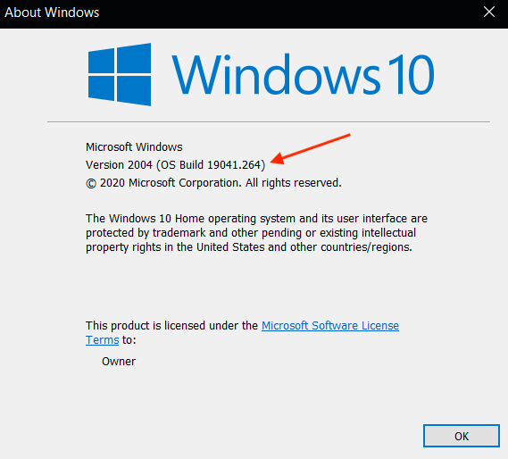

# Set-Up
In this section, we're going to get everything we need ready to complete the workshop steps.

Here's what you'll need:
1. [Clone the repo to your local machine](#clone-the-repo-to-your-local-machine)
2. [Install Terraform](#install-terraform)
3. [Windows Instructions](#windows-instructions)
4. [Have a personal AWS account](#personal-aws-account)
5. [Install AWS CLI and auth via the commandline](#install-the-aws-cli-and-auth-via-the-command-line) 
6. [Have a code editor of your choice](#code-editor)

***


## Clone the Repo to your local machine
Clone this repo. You're going to make it your own and make edits. It's yours to keep and play around.

Choose a directory where you'd like to clone this repo to (it could even just be your desktop)

Run the following in your command line

`git clone git@github.com:DevOps-Girls/terraform-workshop.git`

If you don't have a GitHub account, download the zip folder of the repo:
[Repo Zip Download](https://github.com/DevOps-Girls/terraform-workshop/archive/refs/heads/main.zip)

## Install Terraform
Terraform is used via commands in the command line. For these to work, you need to install it.

Here's how:

### Mac
Follow the instructions in this simple Medium article, let the coaches know if you get stuck!

[Simple Instructions](https://medium.com/@akkireddy/how-to-install-terraform-on-macos-3e09d6a536b1)

Alternatively, you may also be able to run the following:

`brew install terraform`

This is a good option if you've used `brew` previously for installing software onto your Mac

## Windows Instructions
This walkthrough has a few options for installing Terraform for Windows, take the time to have a look at what best works for you:

#### WSL Install (Linux on Windows)
Check your version of Windows

* Press `Windows key` + `R`
* Type: `winver`
Recquired Version: 1903 or higher




* If the version is OK, follow these instructions [Windows Subsystem for Linux Installation Guide for Windows 10](https://docs.microsoft.com/en-us/windows/wsl/install-win10)

#### Docker Install (Ubuntu)
* If the version is older, then the easiest option is to use Docker - [Install Docker for Windows](https://docs.docker.com/docker-for-windows/install/)

* Run docker to spin up a Ubuntu container:
`docker run -it -v //C/path/to/repo:/devopsgirl-terraform ubuntu:latest --name devopsgirls-terraform`


Once you have WSL or Ubuntu using docker, you can now follow the same instructions for Mac to install Terraform

**Here's a link for [Trouble Shooting Tips](https://docs.microsoft.com/en-us/windows/wsl/install-win10#manual-installation-steps)**

## Personal AWS Account
If you don't already have one, you'll have to set up a personal AWS account. If you don't have one, having an AWS account is key if you intend on continuing your AWS learning journey after this workshop.

- If you DO have an account, log in *(preferably not as root and you've set up a user via IAM that has permissions to deploy resources)*

- If you DONT have an account, go [HERE](https://aws.amazon.com/) to create one, you'll need a credit card - Don't worry no cost will be incured today

## Install the AWS CLI and auth via the command line
As we're running commands via the command line that will allow you to deploy AWS resources, you need to authenticate to your personal AWS via the command line.

Here's install instructions for all operating systems: [How to install the AWS CLI 2](https://docs.aws.amazon.com/cli/latest/userguide/install-cliv2.html)

Here's the instructions on how to authenticate via your command line:
NOTE: you'll need to get some details from the AWS web console that'll need to be copy and pasted for this to work
[AWS instructions on how to configure your command line](https://docs.aws.amazon.com/cli/latest/userguide/cli-configure-quickstart.html#cli-configure-quickstart-config)

It'll look something like this:
```
aws configure
```
Then following the prompts you need to provide:
- AWS Access Key ID
- AWS Secret Access Key
- Default region name (for Australia, choose ap-southeast-2)
- Default output format (you can just choose nothing)


## Code Editor
We're going to be writing and editing lines of Terraform config. To do this, it's best to use a code editor.

There's lots of free versions, here's a few to pick from if you don't already have one:

[Visual Studio Code](https://code.visualstudio.com/)
[Atom](https://github.com/atom)
[Sublime Text 3](https://www.sublimetext.com/3)

Here's an even longer [list](https://hackr.io/blog/web-development-ide)

## [NEXT SECTION  - Key Concepts 👉🏽](01-key-concepts.md)