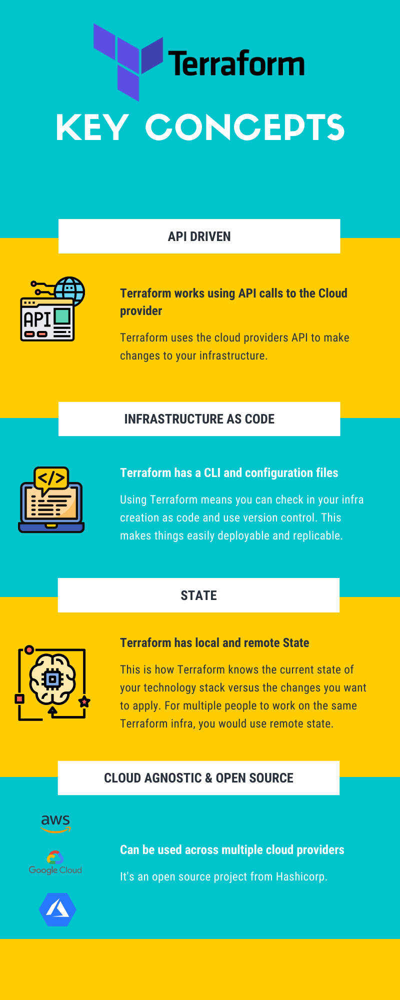

# Key Concepts
This section will cover the key concepts we're going to be referencing throughout the workshop.

## What is Terraform?
Terraform is an open-source tool for building infrastructure as code. It was created by Hashicorp and is maintained and updated by a very active open-source community.

Terraform is made up of its own command line tool, syntax and file/directory structure.

Terraform is cloud agnostic. This means, you can deploy your infrastructure across multiple cloud providers using the same method. This is unlike Cloudformation which is only used for AWS and Azure's Resource Manager templates for deploying to Azure only.

## Why should I be learning Terraform?
Terraform makes infrastructure as code easy and is a really important tool if you want your tech stacks to be easily deployable, version controlled and replicable. 

When new services are introduced to cloud provides such as AWS, you're more likely to be able to deploy it using Terraform before Cloudformation - this is thanks to the highly active open-source community.

Terraform enables you to preview what your changes will do before you deploy. This can be helpful for key infra where you require a high confidence in your changes being deployed.

The documentation is excellent. This means using Terraform can be easier to learn that other methods for infra as code.

## More Key Concepts:

