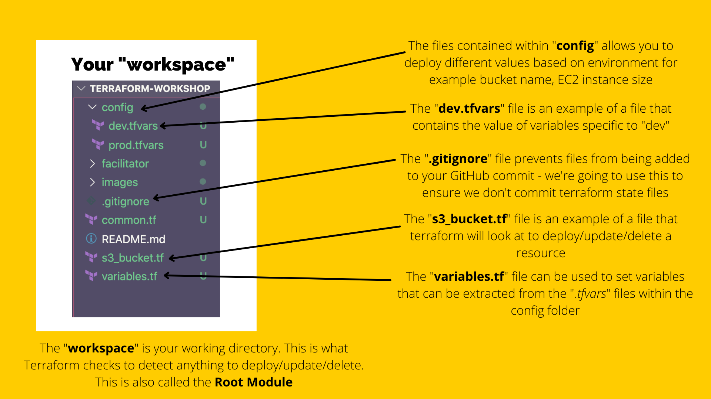

# File Structure
In this section we're going to talk about how your Terraform directory is set up. It's best to now open the repo you cloned in your text editor now.

Let's take a look a the files that make up the repo:

## [NEXT SECTION  - Remote State Set Up 👉🏽](03-remote-state-set-up.md)
