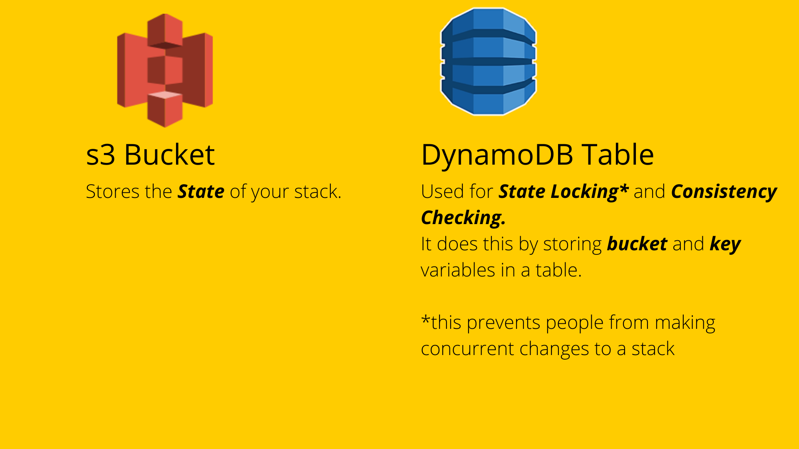

# Remote State - s3 and DynamoDB

In this section we're going to go through the steps of setting up your remote state resources.

There's [more than one way to set up your remote state](https://www.terraform.io/docs/language/settings/backends/index.html), the way we're doing it today is using AWS resources, here's the [official Terraform documentation](https://www.terraform.io/docs/language/settings/backends/s3.html) on this.

We're going to deploy these resources using Cloudformation in ap-southeast-2 Sydney **(Make sure you're in the right region!)**

The Cloudformation template we're using can be found [HERE](../remote-state/stack.yaml).

This [template](../remote-state/stack.yaml) provisions a CloudFormation stack in ap-southeast-2 that contains a S3 bucket named devops-girls-terraform-XXXXX where XXXXX is the ID of the AWS account, as well as a DynamoDB lock table.

To deploy this stack we can log into the AWS Console and follow these steps:

1. Navigate to Cloudformation
2. Click `Create stack`
3. Select `With new resources (standard)`
4. Select `Template is ready`
5. Select `Upload a template file`
6. Click `Choose file`
7. Select your locally saved file `/remote-state/stack.yaml`
8. Click `Next`
9. Give your stack a name `[YOUR-NAME]-terraform-workshop`
10. Rename your `LockTableName` and `StateBucketNamePrefix` parameters (eg. `LockTableName = franca-terraform-workshop-lock-table`, `StateBucketNamePrefix = franca-terraform-workshop-state-bucket`)
11. Click `Next`
12. Click `Next`
13. Click `Submit`

Great job! You've deployed an s3 Bucket and DynamoDB Table

How does this work though?

## [NEXT SECTION - Command Line 👉🏽](04-command-line.md)
