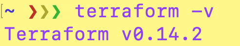
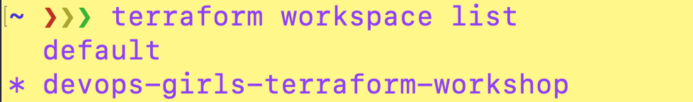

# Terraform in the Command Line

In this section we're going to start running some commands to get our workspace set up and ready to deploy some cloud resources - exciting!

But first, we need confirm our provider details...

## `terraform.tf`

In this file, we are going to configure:

- the version/provider of Terraform we're working with
- our s3 state back end
- AWS as a provider

We need these values before we can initialise our Terraform.

Here's your `terraform.tf` file:

```
terraform {
  required_version = "XXXX"

  required_providers {
    aws = {
      source  = "hashicorp/aws"
      version = "XXXX"
    }
  }

```

Where `XXXX` appears, we need to fill in with some information:

Run the following command to find out what version of Terraform you're working with:

`terraform -version`



In this example, I'd replace `XXXX` with `0.14.2`

To find out the LATEST version of AWS Terraform, you can visit this page: [AWS Latest Version](https://registry.terraform.io/providers/hashicorp/aws/latest)

---

### Terraform initialization

Through a combination of AWS magic and some set variables, we're going to initialize our Terraform and set our remote state at the same time - nice!

Open up your command line tool.

Let's use the AWS CLI to get your AWS account ID to make your bucketname unique and set the region to Sydney.

```
export account_id=$(aws sts get-caller-identity --query Account --output text)
export global_region=ap-southeast-2
```

Now we're going to run the `terraform init` command to configure the backend by mapping to the resources we've created in our [remote-state-set-up](04-remote-state-set-up.md) steps. 

```
  terraform init \
    -backend-config=region=$global_region \
    -backend-config=bucket=devops-girls-terraform-$account_id \
    -backend-config=key=terraform.tfstate \
    -backend-config=dynamodb_table=terraform
```

---


### Define workspace

Now we can create our workspace and give it a name:

```
  export workspace=devops-girls-terraform-workshop

  terraform workspace new $workspace 2> /dev/null || true
  terraform workspace select $workspace
```

To check this has worked, you can run:

`terraform workspace list`

This should show your new workspace. The `*` denotes which workspace you're using:




--- 

<details><summary>Troubleshooting Tips</summary><p>

You'll face some issues if your initialization details don't match your backend you've created:

This needs to match the **s3 Bucket** you created in your [Remote State Stack](../remote_state/stack.yaml)

`-backend-config=bucket=devops-girls-terraform-$account_id \` 


This needs to match the **DynamoDB table** name you created in your [Remote State Stack](../remote_state/stack.yaml)

`-backend-config=dynamodb_table=terraform` 

If you've had some issues already and the `terraform-init` command is telling you the bucket doesn't exist, try the following command to remove th state lock file:

`rm -rf .terraform .terraform.lock.hcl`

</p></details>


## [NEXT SECTION - Terraform Files 👉🏽](05-terraform-files.md)
