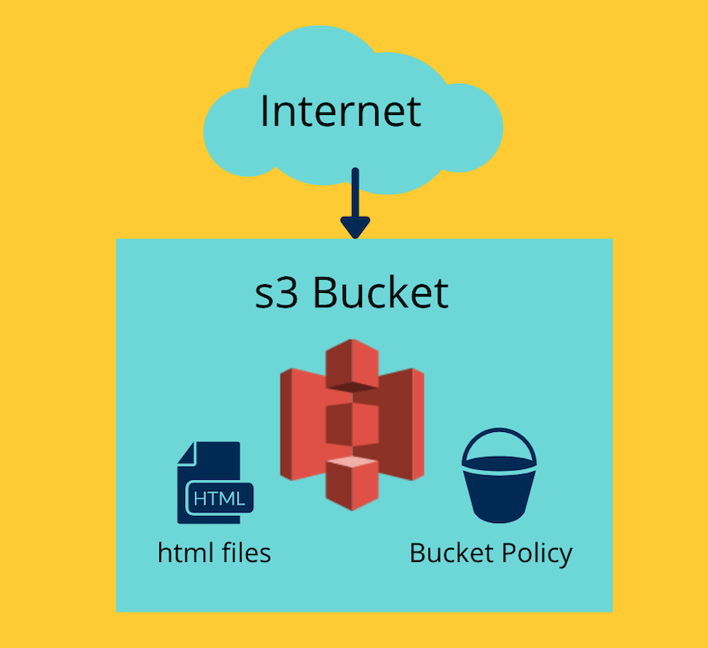

# Terraform Files
In this section we are going to prepare our infrastructure using terraform files!

Here's the files we can now create at the root-level in our repo:


**`terraform.tf`**

In this file, we are going to configure:
* the version/provider of Terraform we're working with
* our s3 state back end
* AWS as a provider

**`variables.tf`**

In this file, we are going to configure any variables we would like to use in our infrastructure as code

**`config/dev.tfvars and prod.tfvars`**

In this file, we are going to provide different variable values based on whether its considered `dev` or `prod`

**`s3_bucket.tf`**

In this file, we are going to configure an s3 bucket that is enabled for basic website hosting

**`policy.json`**

In this file, we are going to provide a bucket policy that enables public-read access so people can view your website

Here's what we're creating:



***

## `terraform.tf`
Now that we have created this file in the root-level of our repo, let's start filling in the required information:

```
terraform {
  required_version = "XXXX"

  required_providers {
    aws = {
      source  = "hashicorp/aws"
      version = "XXXX"
    }
  }

```

Where `XXXX` appears, we need to fill in with some information:

Run the following command to find out what version of Terraform you're working with:

`terraform -version`

To find out the LATEST version of AWS Terraform, you can visit this page: [AWS Latest Version](https://registry.terraform.io/providers/hashicorp/aws/latest)

***

## `variables.tf`
This is file used to declare what variables we will have to work with.

Let's declare `bucket_name` as a variable:
```
variable "bucket_name" {
  type        = string
  description = "The name of the bucket - this must be unique"
}
```

***

## `config/dev.tfvars and prod.tfvars`
Let's now give our `bucket_name` variable a value!

```
bucket_name = "devopsgirls-terraform-[XXXX]-[dev/prod]"
```
Where `XXXX` appears, we need to fill in with some information

As bucket names must be unique, replace `XXXX` with a unique value like your name!

***

## `s3_bucket.tf`
Here's where we configure an s3 bucket for website hosting. Let's try and avoid a simple copy paste and take a look at the official documentation to fill in the required information!

```
# S3 bucket for web hosting
resource "aws_s3_bucket" "web_hosting_bucket" {
  bucket = "XXXX"
  acl    = "XXXX"
  policy = templatefile("policy.json")

  website {
    index_document = "XXXX"
    error_document = "XXXX"
  }
}

resource "aws_s3_bucket_policy" "web_hosting_policy" {
  bucket = aws_s3_bucket.web_hosting_bucket.id

  # Terraform's "jsonencode" function converts a
  # Terraform expression's result to valid JSON syntax.
  policy = jsonencode({
    Version = "2012-10-17"
    Id      = "webhosting-bucket-policy"
    Statement = [
      {
        Sid       = "XXXX"
        Effect    = "XXXX"
        Principal = "*"
        Action    = "XXXX"
        Resource = [
          XXXX
          "XXXX/*",
        ]
      },
    ]
  })
}

```
Where `XXXX` appears, we need to fill in some information:

### s3 Bucket
* `bucket` - we will be using our `bucket_name` variable here - here is the documentation on [How To Use Variables](https://www.terraform.io/docs/language/values/variables.html#using-input-variable-values)
* `acl` - let's take a look at the docs, which value do you think is best for web hosting? [Terraform AWS Docs ACL](https://registry.terraform.io/providers/hashicorp/aws/latest/docs/resources/s3_bucket#acl)
* `index_document` - we've provided you with some basic website files in the folder [website_files](/website_files)
* `error_document` - we've provided you with some basic website files in the folder [website_files](/website_files)

***

### `Bucket Policy`
AWS documentation provides us with the bucket policy required for web hosting, so let's use this to fill in the fields with `XXXX` 

* `Sid, Effect, Action`: [s3 bucket policy for web hosting](https://docs.aws.amazon.com/AmazonS3/latest/userguide/example-bucket-policies.html) - find "Granting read-only permission to an anonymous user"
* `Resource` - you'll need the s3 bucket ARN, which can be done with Terraform - [use this example to work out how to add your ARN](https://registry.terraform.io/providers/hashicorp/aws/latest/docs/resources/s3_bucket_policy#basic-usage)

## Upload Your Website Files
Now that you have an s3 bucket and policy set up for web hosting, you'll need to add some website files. Here's two possible ways to do this:

#### Using the command line:
- navigate to the website_files folder in this repo - `cd website_files`
- sync the contents of this folder with your s3 bucket - `aws s3 sync . s3://yourbucketnamehere`

#### Using the console:
- navigate to your s3 bucket in the console
- click `Upload` and choose the files to upload


## [NEXT SECTION  - Terraform Commands 👉🏽](06-deploy-update-destroy.md)