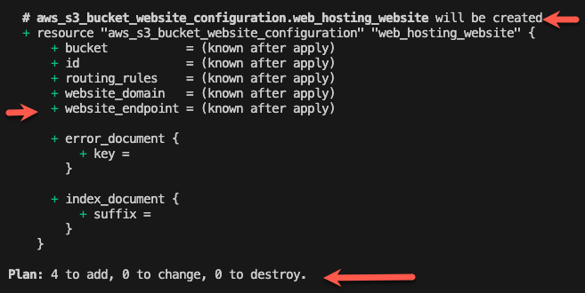

# Terraform Deployments

In this section, we are now going to look at the following Terraform commands:

- Validating
- Plan
- Apply
- Destroy

## Validating your Terraform

Great job! You've added all the pieces of the puzzle! Let's see if our terraform is valid!

If you are not already at the root of your directory
e.g. 
```
USERNAME terraform-workshop %
```
Navigate back there in your terminal.


Run the following command to fix any formatting issues with your Terraform:

```
terraform fmt -diff
```

Run the following command to confirm your config is valid:

```
terraform validate
```

Running the command above may return an error for you to fix. Here's tips for debugging:

- Read the error message carefully, it will usually tell you exactly where there's an error
- Check the consistency on naming your variables, for example using `bucket_name` and then `bucketname` will cause issues
- Doing an internet search of the error you're getting

## Terraform Plan

`Plan` is the way Terraform tells you what it is planning to deploy. This helps make your deployments safer as you can validate the changes you are expecting to see - as opposed to unexpectated changes that could lead to a potential incident.

Run the following command:

```
terraform plan -var-file="config/dev.tfvars"
```

By adding the `-var-file` input you can specify which variable values you would like to apply to your stack - in our case our bucket name is different for dev and prod.



Each plan item will show the following

#### The name of the resource it is creating according to Terraform. 
* A resource such as an S3 bucket may have multiple items in the plan such as a policy, bucket and public access block.

#### A key to show each variable in it after the plan is applied.
* Each variable the API call needs will be shown with changes if there are any.
* If the resource is retrieved from the api, this will show known after apply. 
* `+` symbol means this is a new variable added or a new resource created.
* `~` symbol means this is a change to an existing variable.
* `-` symbol means this is a removal of a variable or a resource.

The most important part to check what it is planning to create, change or destroy before applying your plan.

```
## e.g make sure the numbers below match the resources your looking to change. 

Plan: 4 to add, 0 to change, 0 to destroy.
```

## Terraform Apply

Once you're happy with 'the plan', you can now deploy your changes! This is the command we will be running:

```
terraform apply -var-file="config/dev.tfvars"
```
It will first show you your plan and then create the resources. 

After the apply has completed it will show you what number of resources have been changed. 
```
Apply complete! Resources: 4 added, 0 changed, 0 destroyed.
```

**NOTE: If you have made changes since last running `terraform plan`, you will need to run this again before running `terraform apply`**

Hopefully your stack deploys without any issues and your s3 bucket is now deployed.

If you don't want to have to approve each time (for instance running in a build pipeline), There are some additional inputs you can use to [auto approve your plan to apply.](https://developer.hashicorp.com/terraform/tutorials/automation/automate-terraform?utm_source=WEBSITE&utm_medium=WEB_IO&utm_offer=ARTICLE_PAGE&utm_content=DOCS#automated-terraform-cli-workflow)

## Upload Your Website Files

Now that you have an s3 bucket and policy set up for web hosting, you'll need to add some website files. Here's two possible ways to do this:

#### Using the command line:

- navigate to the website_files folder in this repo - `cd website_files`
- sync the contents of this folder with your s3 bucket:

```
aws s3 sync . s3://yourbucketnamehere
```

#### Using the console:

- navigate to your s3 bucket in the console
- click `Upload` and choose the files to upload

## Check your website

There's a few ways you can check the success:

- Run `aws s3 ls` in the command line and find your bucket
- Log into the AWS console in the browser and find your bucket
- Hit your s3 bucket website from a browser: `http://[BUCKET_NAME].s3-website-ap-southeast-2.amazonaws.com/`

_If you want to deploy your prod stack just update the name of the tfvars file from `config/dev.tfvars` to `config/prod.tfvars`_

## Terraform Destroy

Now that it's time to clean up our work, let's destroy our stack! If you ever want to get your stack back, that is the beauty of infrastructure as code - you can easily re-deploy it exactly as it was before.

To clean up your account, run the following command:

```
terraform plan -destroy -var-file="config/dev.tfvars"
```

and if you are happy with the 'destroy plan', 

[**make sure your s3 bucket is empty**](https://docs.aws.amazon.com/AmazonS3/latest/userguide/empty-bucket.html), then run:

```
terraform destroy -var-file="config/dev.tfvars"
```

Great work! Now you can use the suggestions above to also confirm your s3 bucket has in fact been deleted.

_If you want to destroy your prod stack just update the name of the tfvars file from `config/dev.tfvars` to `config/prod.tfvars`_

Remember to also delete the Cloudformation stack holding your remote state setup
-  after emptying your state bucket or the Cloudformation delete will fail. [If you created a bucket with versioning, you may also need to disable this.](https://repost.aws/knowledge-center/s3-delete-bucket) 

- delete the `[YOUR-NAME]-terraform-workshop` from the Cloudformation console.

## [NEXT SECTION - Summary 👉🏽](08-summary.md)
